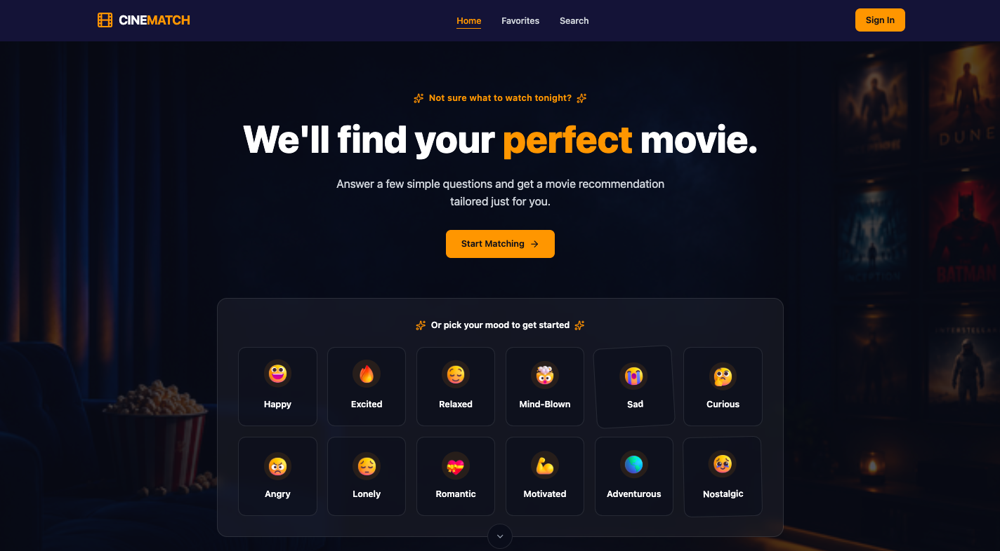

# 🍿🎬 CineMatch — AI-Powered Movie Discovery Platform

Discover movies based on your mood, preferences, and desired viewing experience. CineMatch combines AI-powered recommendations with real-time movie data to help users find their next favorite movie without endless scrolling through streaming platforms.

## Table of contents

- [Overview](#overview)
- [Features](#features)
- [Tech Stack](#tech-stack)
- [Why this project](#why-this-project)
- [Implementation notes](#implementation-notes)
- [Future improvements](#future-improvements)
- [How to run (local)](#how-to-run)

## Overview

### About

CineMatch is an AI-powered movie discovery platform that helps users find personalized movie recommendations based on their mood, preferred genres, available watch time, and the type of experience they are looking for.

Users can either complete a short recommendation questionnaire or use the Surprise Me feature to instantly receive a movie suggestion. Recommendations are generated using Gemini AI and enriched with real-time movie data from TMDB, including ratings, trailers, cast information, streaming availability, and similar movie suggestions.

The project focuses on creating a modern and engaging movie discovery experience while showcasing AI integration, external API consumption, authentication, database management, and responsive frontend development.

### 📸 Screenshot



<br/>

### Links

- Live Demo: [Demo](https://cinematch-jacob.netlify.app)

---

## ✨ Features

- AI-powered movie recommendations using Gemini AI
- Mood-based recommendation questionnaire
- "Surprise Me" instant movie recommendation feature
- Detailed movie recommendation pages
- Real-time movie data powered by TMDB (ratings, posters, cast, trailers, genres, runtime, and similar movies)
- Movie search functionality
- Save movies to favorites
- User authentication with Firebase
- Persistent favorites across devices
- Similar movie recommendations
- Movie trailers and streaming availability
- Responsive mobile and desktop experience

---

## 🛠 Tech Stack

- Frontend: React (Vite)

- Language: TypeScript

- Routing: React Router

- Styling: Tailwind CSS

- Animation: Framer Motion

- Authentication: Firebase Authentication

- State Management: Zustand

- Database: Firestore

- AI: Google Gemini API

- Movie Data: TMDB API

- Hosting: Netlify

---

## 📌 Why this project

This project was built to demonstrate:

- Integration of Generative AI into a real-world product
- Consuming and combining multiple external APIs
- Authentication and database management with Firebase
- Building personalized user experiences
- Responsive UI/UX design across devices

Rather than creating another traditional movie website, I wanted to build a product that helps users solve a common problem: deciding what movie to watch.

---

## 🏗️ Implementation notes

- **AI Recommendation Engine**: User responses from the recommendation questionnaire are sent to Gemini AI, which analyzes mood, preferences, and desired experience to recommend a suitable movie.

- **TMDB Integration**: After Gemini selects a movie, TMDB is used to retrieve rich metadata such as posters, ratings, cast information, trailers, genres, runtime, and similar movies.

- **Guest-Friendly Experience**: Users can receive movie recommendations without creating an account. Authentication is only required when saving movies to favorites.

- **Favorites Management**: Guest favorites are stored locally, while authenticated users have favorites synced to Firestore for persistence across devices.

- **Personalized Recommendation Reasoning**: Every recommendation includes an explanation describing why the movie was selected based on the user's responses.

---

## 📚 Future improvements

- Recommendation history
- User movie ratings and reviews
- Cinema discovery based on user location
- Social sharing of recommendations
- AI movie comparison assistant
- Personalized recommendation learning based on favorites and viewing history

---

## 📦 How to run

1. Clone the repository:

   ```sh
   git clone https://github.com/yourusername/cinematch.git
   ```

2. Navigate to the project folder:

   ```sh
   cd cinematch
   ```

3. Install dependencies:

   ```sh
   npm install
   ```

4. Create a `.env` file:

   ```env
   VITE_FIREBASE_API_KEY=your_key
   VITE_FIREBASE_AUTH_DOMAIN=your_domain
   VITE_FIREBASE_PROJECT_ID=your_project_id
   VITE_TMDB_API_KEY=your_tmdb_key
   ```

5. Start the development server:

   ```sh
   npm run dev
   ```
